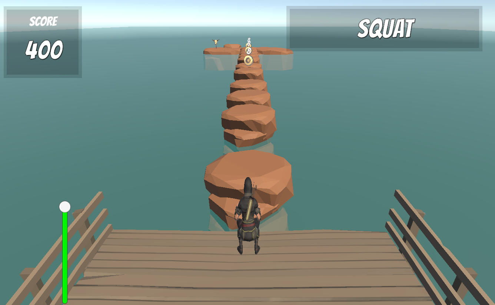
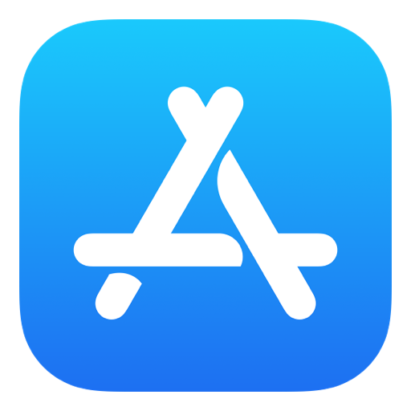

# Fit Pixels

## What is it?

A game designed to help you be more active.

## About the game

We use the posture and pose of the user to move the character in the game. We have a proof-of-concept, that we want to turn into an engaging game for you. Together we can make fitness fun.

_Character that moves entirely based on user's movement._

## Try it. 

We want to make a game that caters to your needs, which is why your feedback is critical for us.
Try the game and let us know your thoughts.
Sign up [here](https://forms.gle/dd22ndE1Mvdy1idn9) for early access. 

<!-- Download Icons Section -->

    
    
    
    <!--  -->

## About us.

We the best. 

## Contact
Email: [fitpixels2024@gmail.com](mailto:fitpixels2024@gmail.com "Fit Pixels's contact email.")